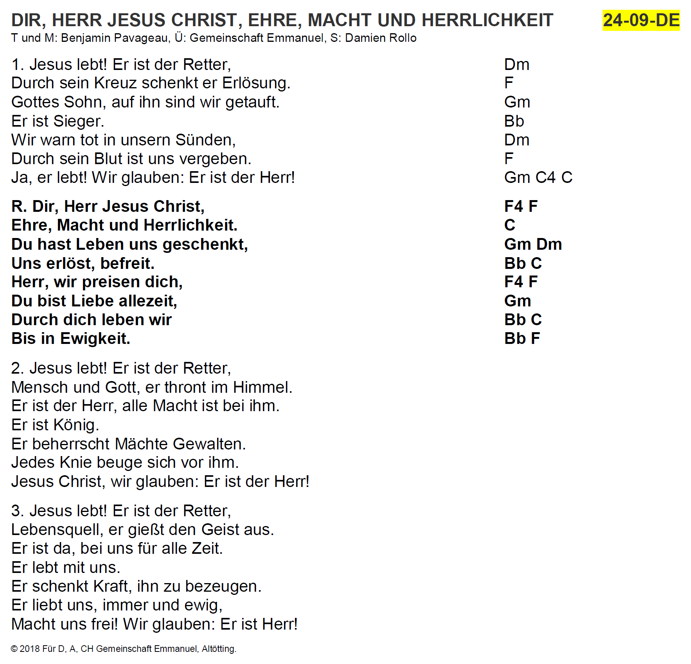

# Songs2Docx
Collection of script to create DOCX-files.
* songs2docx
* prepare_song_txt_files

## songs2docx
Converts TXT files in a INI-like, but proprietary format (used for simplicity) to a DOCX file in a certain format using python-docx.

### Install
#### Create a conda environment
```bash
conda init bash # => Open new terminal
conda create --name songs2docx python=3.7
conda install --name songs2docx python-docx
```

### Run
#### Activate the conda environment and start the program
```bash
cd songs2docx/
conda activate songs2docx
python songs2docx.py songs/*.txt --output=output
```

### Custom script to call convert.bat
Create a batch file e.g. called `convert_custom.bat` in the root directory (which contains all TXT input files, possibly in some subfolder) and place the code as described below in it. Adapt all <...> with the correct paths.
```cmd
@echo OFF

rem Get the path where the script is located
set SCRIPT_PATH="<SONGS2DOCX_PYTHON_PROJECT_PATH>"

rem Define here the path to your conda installation
set CONDAPATH=<CONDA_INSTALL_DIR>

rem Run the command with the specific paths
%SCRIPT_PATH%\convert.bat "<TXT_INPUT_FOLDER>\**\*.txt" "<DOCX_OUTPUT_FOLDER>"
```

### Example
#### Input TXT
```
TITLE=DIR, HERR JESUS CHRIST, EHRE, MACHT UND HERRLICHKEIT
REF_NO=24-09-DE
AUTHORS=T und M: Benjamin Pavageau, Ü: Gemeinschaft Emmanuel, S: Damien Rollo
COPYRIGHT=© 2018 Für D, A, CH Gemeinschaft Emmanuel, Altötting.

1. Jesus lebt! Er ist der Retter,	Dm
Durch sein Kreuz schenkt er Erlösung.	F 
Gottes Sohn, auf ihn sind wir getauft.	Gm
Er ist Sieger.	Bb
Wir warn tot in unsern Sünden,	Dm
Durch sein Blut ist uns vergeben.	F
Ja, er lebt! Wir glauben: Er ist der Herr!	Gm C4 C

<b>R. Dir, Herr Jesus Christ,	F4 F
Ehre, Macht und Herrlichkeit.	C
Du hast Leben uns geschenkt,	Gm Dm
Uns erlöst, befreit.	Bb C
Herr, wir preisen dich,	F4 F
Du bist Liebe allezeit,	Gm
Durch dich leben wir	Bb C
Bis in Ewigkeit.	Bb F</b>

2. Jesus lebt! Er ist der Retter,
Mensch und Gott, er thront im Himmel.
Er ist der Herr, alle Macht ist bei ihm.
Er ist König.
Er beherrscht Mächte Gewalten.
Jedes Knie beuge sich vor ihm.
Jesus Christ, wir glauben: Er ist der Herr!

3. Jesus lebt! Er ist der Retter,
Lebensquell, er gießt den Geist aus.
Er ist da, bei uns für alle Zeit.
Er lebt mit uns.
Er schenkt Kraft, ihn zu bezeugen.
Er liebt uns, immer und ewig,
Macht uns frei! Wir glauben: Er ist Herr!
```

#### Output DOCX (Screenshot)



## prepare_song_txt_files
Preprocesses TXT files exported from the Finale software. Adds meta information and performs simple but laborious preprocessing steps.


### Install
#### Create a conda environment
```bash
conda init bash # => Open new terminal
conda create --name prepare_song_txt_files python=3.7
conda install --name prepare_song_txt_files pandas
conda install --name prepare_song_txt_files openpyxl
```

### Run
#### Activate the conda environment and start the program
```bash
cd songs2docx/
conda activate prepare_song_txt_files
python prepare_song_txt_files.py songs/**/*.txt --output=output --suppress_error_output=False --excel_database="Liedgut.xlsx" --song_name_assignment="song_name_assignment.txt"
```

### Processing steps
* Load TXT file
* Perform adaptations of continuous text
* Read title from content
* Assign TXT file with entry in Excel song database (where necessary, use assignment file to assign the title from the file's content with the title in the DB, which might differ)
* Read assigned data from database
* Create header-string from database information
* Perform adaptations of text line by line whose result is the body-string
* Join header and body
* Return result


### Custom script to call convert.bat
See section _Custom script to call convert.bat_ in _songs2docx_. It's essentially the same.